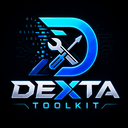
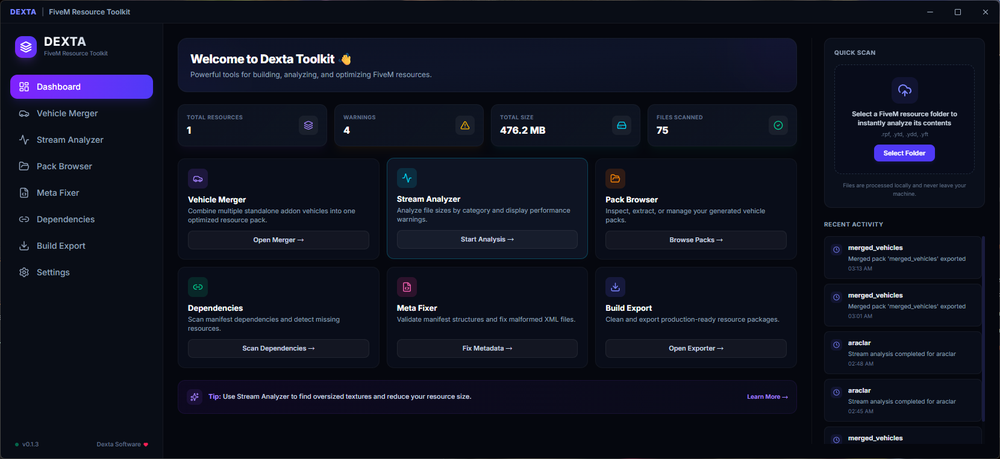
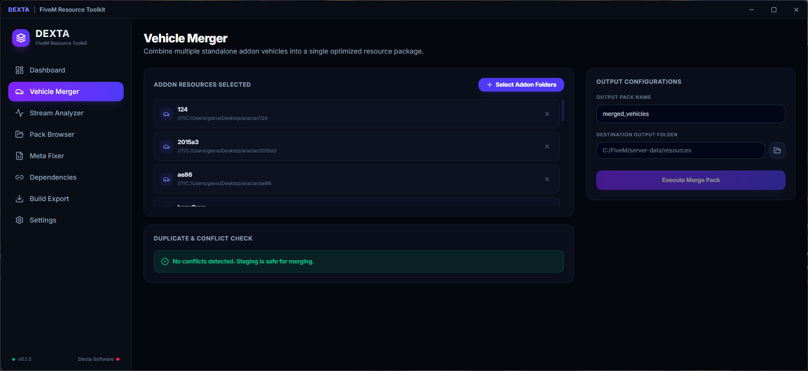

# 🚀 Dexta Toolkit — FiveM Resource Optimizer & Manager

<div align="center">
  
  <h3>A premium, high-performance desktop application for FiveM resource developers and server administrators.</h3>
  <p>Analyze, validate, merge, configure, and clean-export your server assets with a sleek, GPU-accelerated interface powered by <b>Tauri, Rust, and React</b>.</p>

  [](https://github.com/thesolitudetr/fivem-toolkit)
  [](https://github.com/thesolitudetr/fivem-toolkit)
  [](https://tauri.app/)
  [](https://www.rust-lang.org/)
  [](https://www.typescriptlang.org/)
</div>

---

## 🌟 Core Modules

Dexta Toolkit packages essential utilities into a fast, unified developer console designed to keep your server optimized, clean, and free of asset-related performance drops.

### 📊 1. Stream Analyzer
* **Smart Recursive Scan**: Recursively searches any resource folder to index textures, 3D models, audio, and maps.
* **Warning System**: Flags oversized `.ytd` (texture dictionaries), `.yft` (vehicle models), and `.awc` (audio files) based on custom threshold configurations.
* **Comprehensive Export**: Generates detailed statistical reports in **HTML, Markdown, or JSON** for easy sharing and audit trails.

### 🚗 2. Vehicle Pack Merger (with Conflict Resolver)
* **Zero-Clash Merging**: Combines multiple standalone vehicle resources into a single organized addon pack.
* **Collision Detection**: Scans spawn codes (model names) and stream filenames in real-time to alert you of duplicates before merging.
* **Metadata Compiler**: Merges handling, vehicle layouts, carcols, and carvariations XML manifests into unified meta structures.
* **ModKit & Siren Conflict Resolver (v0.2.0)**: Automatically detects duplicate ModKit IDs and `sirenSettings` IDs during merging, remapping duplicates to unique, unused IDs and dynamically rewriting all references in `carcols.meta` and `carvariations.meta`.

### ⚙️ 3. Vehicle Configurator (Visual Handling & Sound Editor) (v0.2.0)
* **Physics Tuning**: Interactively edit vehicle handling parameters (Vehicle Mass, Drag Coefficient, Brake Force, Engine Drive Force, and Deformation Damage multiplier) using visual sliders.
* **Audio & Presets**: Swap engine sound hashes (`audioNameHash`) and layouts using predefined presets or custom hashes, and write them back safely to XML.

### 🖼️ 4. YTD Texture Browser (v0.2.0)
* **Native RSC7 Inspector**: Inspects texture dictionaries (`.ytd`) directly to list embedded texture names. Uses a native Rust binary parser designed to run fully cross-platform on Windows and Linux without external C# dependencies.

### 🛠️ 5. Meta Fixer & Validator (with Server Linter) (v0.2.0)
* **Structure Diagnostics**: Inspects `fxmanifest.lua` files for syntax issues, outdated APIs, and missing file declarations.
* **Non-destructive Repairs**: Proposes corrections and generates staged folders, keeping your original directories completely untouched.
* **Server Linter Mode**: Scan your entire server resource directory in bulk to detect legacy `__resource.lua` manifests and convert them to modern `fxmanifest.lua` in-place with a single click.

### 🔗 6. Dependency Scanner
* **Dependency Auditing**: Inspects your script manifests to compile an active dependency graph.
* **Server Root Verification**: Matches dependencies against your local server resources folder to alert you of missing scripts before runtime.

### 📦 7. Build Exporter
* **Clean Distribution**: Trims Git files, node caches, temp logs, and test assets from your resources.
* **Production Packaging**: Outputs organized folders or compressed ZIP archives ready to deploy directly into your server.

---

## 📸 Screenshots

Here are some screenshots of the application:

<div align="center">
  
  <p><i>Sleek and comprehensive Dashboard featuring resource statistics, active logs, and one-click update checks.</i></p>
  
  
  <p><i>GPU-accelerated interface for zero-clash vehicle pack merging with conflict diagnostic notifications.</i></p>
</div>

---

## 🛠️ Tech Stack & Architecture

Dexta Toolkit is engineered using modern, memory-safe, and high-performance components:
* **Frontend**: React 19, TypeScript, Tailwind CSS v4, Lucide Icons, Framer Motion.
* **Backend Core**: Rust (Tauri v2) for recursive file I/O operations and native OS Dialog interactions.
* **Local Database**: Persistent local configurations and activity logs managed via an app-data SQLite schema.
* **Cross-Platform Compatibility**: Native Rust implementation ensures that metadata parsing, conflict resolution, YTD scanning, and resource linting run seamlessly on **Windows, Linux, and macOS**.

---

## ⚙️ Development & Build Setup

### 📋 Prerequisites
Ensure you have the following installed on your machine:
* **Node.js** (v20+ recommended)
* **pnpm** (v10+ recommended)
* **Rust & Cargo** (stable toolchain)

### 🚀 Running Locally
1. Clone the repository:
   ```bash
   git clone https://github.com/thesolitudetr/fivem-toolkit.git
   cd fivem-toolkit
   ```
2. Install node dependencies:
   ```bash
   pnpm install
   ```
3. Start the application in development mode:
   ```bash
   pnpm tauri dev
   ```

### 🧪 Running Unit Tests
Execute the Rust test suite targeting the scanner, merger, and fixing routines:
```bash
cd src-tauri
cargo test
```

---

## 📦 Production Builds

### 🪟 Windows (MSI & Setup EXE)
Run the default Tauri build command:
```bash
pnpm tauri build
```
The production packages will be generated under:
* `src-tauri/target/release/bundle/msi/`
* `src-tauri/target/release/bundle/nsis/`

### 🐧 Linux (Debian & AppImage)
1. Install compilation libraries:
   ```bash
   sudo apt update
   sudo apt install -y build-essential curl wget libssl-dev libgtk-3-dev libayatana-appindicator3-dev librsvg2-dev libwebkit2gtk-4.1-dev libsoup2.4-dev
   ```
2. Build the Linux bundles:
   ```bash
   pnpm tauri build
   ```
The output files will be generated under:
* `src-tauri/target/release/bundle/deb/`
* `src-tauri/target/release/bundle/appimage/`

---

## 🆕 Changelog

### v0.2.0
* **⚡ ModKit & Siren ID Conflict Resolver**: Auto-resolves overlapping ModKit and Siren settings IDs when merging vehicles, remapping them to unused values and updating all references in XML metadata.
* **🚗 Visual Handling & Sound Editor**: A new dedicated module to configure vehicle handling (mass, drag, engine power, brakes, damage multipliers) and swap engine audio hashes visually.
* **🖼️ Cross-Platform YTD Texture Browser**: Native RSC7 file scanner to read and list embedded texture dictionary entries inside `.ytd` files on both Windows and Linux without C# wrappers.
* **🛠️ Server Resource Linter**: Extended the Meta Fixer to support "Server Linter Mode", letting you bulk-scan resources and convert outdated `__resource.lua` files to `fxmanifest.lua` in-place.
* **🐧 Linux Host Optimization**: Ensured complete cross-platform support. All modules compile and run on native Linux (no Wine or Windows executables required for merging, editing, parsing, or linting).

### v0.1.5
* **⚡ Structural XML Vehicle Merger Upgrade**: Rewrote the XML merger module using a universal structural XML tokenizer. This solves the issue where merged vehicle packs could not be spawned in-game. It correctly preserves `<residentTxd>`, `<residentAnims>`, `<txdRelationships>` (in `vehicles.meta`), `<Sirens>` and `<Wheels>` (in `carcols.meta`), `<VehicleLayoutInfos>` (in `vehiclelayouts.meta`), and writes standard-compliant `<CVehicleModelInfoVariation>` tags (in `carvariations.meta`).
* **🖼️ YTD Texture Optimizer Module**: Integrates C# CodeWalker and Microsoft `texconv` toolchains to automatically downscale and optimize `.ytd` texture dictionaries in a single click, preventing FiveM memory overflow warnings (Windows only).

---

## 🛡️ License

This project is licensed under the MIT License - see the [LICENSE](LICENSE) file for details.
